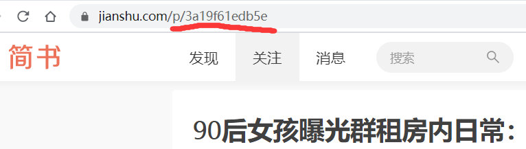

# Scrapy+selenium爬取简书全站

-scrapy-

关于使用scrapy框架编写爬虫以及Ajax动态加载问题、反爬问题解决方案


总的来说，Python爬虫所做的事情分为两个部分，1：将网页的内容全部抓取下来，2：对抓取到的内容和进行解析，得到我们需要的信息。

 

目前公认比较好用的爬虫框架为Scrapy，而且直接使用框架比自己使用requests、 beautifulsoup、 re包编写爬虫更加方便简单。

 


### 关于Scrapy框架


简介： Scrapy是一个为了爬取网站数据，提取结构性数据而编写的应用框架。 其最初是为了 页面抓取 (更确切来说, 网络抓取 )所设计的， 也可以应用在获取API所返回的数据(例如 Amazon Associates Web Services ) 或者通用的网络爬虫。

 

官方文档地址 ： http://scrapy-chs.readthedocs.io/zh_CN/1.0/index.html

 

Scrapy安装 ：  pip install Scrapy

 

创建Scrapy项目 ： scrapy startproject scrapyspider(projectname)

该命令创建包涵下列内容的目录：

 

这些文件分别是:

scrapy.cfg: 项目的配置文件。
scrapyspider/: 该项目的python模块。之后您将在此加入代码。
scrapyspider/items.py: 项目中的item文件。
scrapyspider/pipelines.py: 项目中的pipelines文件，用来执行保存数据的操作。
scrapyspider/settings.py: 项目的设置文件。
scrapyspider/spiders/: 放置爬虫代码的目录。

首先，在items.py文件中声明需要提取的数据，Item 对象是种简单的容器，保 存了爬取到得数据。 其提供了 类似于词典(dictionary-like) 的API以及用于声明可 用字段的简单语法。许多Scrapy组件使用了Item提供的额外信息: exporter根据 Item声明的字段来导出 数据、 序列化可以通过Item字段的元数据(metadata) 来 定义、trackref 追踪Item 实例来帮助寻找内存泄露 (see 使用 trackref 调试内 存泄露) 等等。
Item使用简单的class定义语法以及Field对象来声明。我们打开scrapyspider目录下的items.py文件写入下列代码声明Item：

为了创建一个爬虫，首先需要继承scrapy.Spider类，定义以下三个属性：

​	**1.name : 用于区别不同的爬虫，名字必须是唯一的.**

​	**2.start_urls: 包含了Spider在启动时进行爬取的url列表。**

​	**3.parse() 是spider的一个函数。 被调用时，每个初始URL完成下载后生成的 Response 对象将会作为唯一的参数传递给该函数，然后解析提取数据。**

 

 


### 关于抓取Ajax异步加载的网站

 

Ajax是什么：

 

AJAX即“Asynchronous Javascript And XML”（异步JavaScript和XML），是指一种创建交互式网页应用的网页开发技术。

通过在后台与服务器进行少量数据交换，AJAX 可以使网页实现异步更新。这意味着可以在不重新加载整个网页的情况下，对网页的某部分进行更新。

通过Ajax异步加载的网页内容在网页源码中是没有的，也就是之前介绍的方法中下载到的response中是解析不到我们想要的内容的。

 

如何抓取AJAX异步加载页面：

 

对于这类网页，我们一般采用两种方法：

1、通过抓包找到异步加载请求的真正地址

2、通过PhantomJS等无头浏览器执行JS代码后再抓取

但是通常采取第一种方法，因为第二种方法使用无头浏览器会大大降低抓取的效率。

 

文章信息网页源码中没有，并且采用鼠标下拉更新页面，这时需要我们在需要抓取的页面打开Chrome的开发者工具，选择network，实现一次下拉刷新

 


 

发现新增了一个get请求，并且响应为JSON格式。观察JSON的内容，发现正是需要抓取的内容。

抓取内容的问题解决了，接下来处理多页抓取问题，因为请求为get形式，所以首先进行几次下拉刷新，观察请求链接的变化，会发现请求的地址中只有start的值在变化，并且每次刷新增加20，其他都不变，所以我们更改这个参数就可以实现翻页。


　　scrapy crawl name

 

 

然而，很多时候ajax请求都会经过后端鉴权，不能直接构造URL获取。这时就可以通过PhantomJS、chromedriver等配合Selenium模拟浏览器动作，抓取经过js渲染后的页面。

使用这种方法有时会遇到定位网页页面元素定位不准的情况，这时就要注意网页中的frame标签，frame标签有frameset、frame、iframe三种，frameset跟其他普通标签没有区别，不会影响到正常的定位，而frame与iframe对selenium定位而言是一样的，需要进行frame的跳转。（这两点暂不展开，在抓取中财网—数据引擎网站时就遇到此类问题）

 

 

彩蛋：

两个提高效率的Chrome插件：

　　Toggle JavaScript  （检测网页哪些内容使用了异步加载）  

　　JSON-handle （格式化Json串）

 

 

### 关于突破爬虫反爬机制

 

   目前使用到的反反爬手段主要有三个：

 

1、在请求之间设置延时，限制请求速度。（使用python time库）

 

2、在每次请求时都随机使用用户代理User-Agent，为了方便，在scrapy框架中，可以使用fake-useragent这个开源库。


3、使用高匿代理ip，同样为了方便，在scrapy框架中编写爬虫，建议使用开源库 scrapy-proxies。


### 环境

- Windows 10

- Python 3.7.4

- Scrapy 

  

### 爬取内容

- 文字标题
- 作者
- 作者头像
- 发布日期
- 内容
- 文章连接
- 文章ID


### 思路

- 分析简书文章的url规则
- 使用selenium请求页面
- 使用xpath获取需要的数据
- 异步存储数据到MySQL（提高存储效率）

---

### 整个爬虫的执行流程

- 首先从start_urls 里取出要执行的请求地址
- 返回的内容经过下载中间件进行处理（selenium加载动态数据）
- 经过中间件处理的数据（response）返回给爬虫进行提取数据
- 提取出的数据返回给pipeline进行存储

### 实现

##### 前戏：

- 创建scrapy项目
- 建立crawlsipder爬虫文件
- 打开`pipelines`和`middleware`

##### 第一步：分析简书文章的url



可以看到url规则为`jianshu.com/p/文章ID`，然后再crawlsipder中设置url规则

```python
class JsSpider(CrawlSpider):
    name = 'js'
    allowed_domains = ['jianshu.com']
    start_urls = ['http://jianshu.com/']
    rules = (
        Rule(LinkExtractor(allow=r'.+/p/[0-9a-z]{12}.*'), callback='parse_detail', follow=True),
    )

```

##### 第二步：使用selenium请求页面

设置下载器中间件

- 由于作者、发布日期等数据由Ajax加载，所以使用selenium来获取页面源码以方便xpath解析

- 有时候请求会卡在一个页面，一直未加载完成，所以需要设置超时时间

- 同理Ajax也可能未加载完成，所以需要显示等待加载完成

```python
import time

from selenium import webdriver
from scrapy.http.response.html import HtmlResponse

class SeleniumDownloadMiddleware(object):

    def __init__(self):
        # 加载测试浏览器
        self.driver = webdriver.Chrome(executable_path=r"D:\xsy的秘密小屋					 \Google\Google\Chrome\Application\chromedriver.exe")

    # request: 则scrapy框架会去服务器加载资源
    # reponse: 则跳过资源下载直接交给解析器方法
    def process_request(self, request, spider):
        self.driver.get(request.url)
        time.sleep(2)
        try:
            while True:
                showMore = self.driver.find_element_by_class_name('show-more')  # 获取标签
                showMore.click()
                time.sleep(0.5)
                if not showMore:
                    break
        except:
            pass
        source = self.driver.page_source
        response = HtmlResponse(url=self.driver.current_url, body=source, request=request, encoding='utf-8')
        return response
```

注意提前将 chromedriver 放到`/user/bin`下，或者自行指定执行路径。windows下可以讲其添加到环境变量下。

##### 第三步：使用xpath获取需要的数据

设置好item

```python
import scrapy


class JianshuCrawlItem(scrapy.Item):
    title = scrapy.Field()
    content = scrapy.Field()
    author = scrapy.Field()
    avatar = scrapy.Field()
    pub_time = scrapy.Field()
    origin_url = scrapy.Field()
    article_id = scrapy.Field()

```


分析所需数据的xpath路径，进行获取需要的数据,并交给`pipelines`处理

```python
from scrapy.linkextractors import LinkExtractor
from scrapy.spiders import CrawlSpider, Rule
from ..items import JianshuCrawlItem as Jitem


class JsSpider(CrawlSpider):
    name = 'js'
    allowed_domains = ['jianshu.com']
    start_urls = ['http://jianshu.com/']
    rules = (
        Rule(LinkExtractor(allow=r'.+/p/[0-9a-z]{12}.*'), callback='parse_detail', follow=True),
    )

    def parse_detail(self, response):
        # 使用xpath获取数据
        title = response.xpath("//h1[@class='_2zeTMs']/text()").get()
        author = response.xpath("//a[@class='_1OhGeD']/text()").get()
        avatar = response.xpath("//img[@class='_13D2Eh']/@src").get()
        pub_time = response.xpath("//div[@class='s-dsoj']/time/text()").get()
        content = response.xpath("//article[@class='_2rhmJa']").get()
        origin_url = response.url
        article_id = origin_url.split("?")[0].split("/")[-1]
        print(title)  # 提示爬取的文章
        item = Jitem(
            title=title,
            author=author,
            avatar=avatar,
            pub_time=pub_time,
            origin_url=origin_url,
            article_id=article_id,
            content=content,
        )
        yield item
```

##### 第四步：存储数据到数据库中

我这里用的数据库是MySQL，其他数据同理，操作数据的包是`pymysql`

提交数据有两种思路，顺序存储和异步存储

由于scrapy是异步爬取，所以顺序存储效率就会显得比较慢，推荐采用异步存储

**顺序存储：实现简单、效率低**

```python
class JianshuCrawlPipeline(object):
    def __init__(self):
        dbparams = {
            'host': '127.0.0.1',
            'port': 3306,
            'user': 'root',
            'password': '3321',
            'database': 'jianshu',
            'charset': 'utf8mb4',
        }
        self.conn = pymysql.connect(**dbparams)
        self.cursor = self.conn.cursor()
        self._sql = None

    def process_item(self, item, spider):
        self.cursor.execute(self.sql, (item['title'], item['content'], item['author'],
                                       item['avatar'], item['pub_time'],
                                       item['origin_url'], item['article_id']))
        self.conn.commit()
        return item

    @property
    def sql(self):
        if not self._sql:
            self._sql = '''
            insert into article(id,title,content,author,avatar,pub_time,origin_url,article_id)\
            values(null,%s,%s,%s,%s,%s,%s,%s)'''
        return self._sql
    
```

**异步存储：复杂、效率高**

```python
import pymysql
from twisted.enterprise import adbapi


class JinshuAsyncPipeline(object):
    '''
    异步储存爬取的数据
    '''

    def __init__(self):
        # 连接本地mysql
        dbparams = {
            'host': '127.0.0.1',
            'port': 3306,
            'user': 'debian-sys-maint',
            'password': 'lD3wteQ2BEPs5i2u',
            'database': 'jianshu',
            'charset': 'utf8mb4',
            'cursorclass': pymysql.cursors.DictCursor
        }
        self.dbpool = adbapi.ConnectionPool('pymysql', **dbparams)
        self._sql = None

    @property
    def sql(self):
        # 初始化sql语句
        if not self._sql:
            self._sql = '''
                  insert into article(id,title,content,author,avatar,pub_time,origin_url,article_id)\
                  values(null,%s,%s,%s,%s,%s,%s,%s)'''
        return self._sql

    def process_item(self, item, spider):
        defer = self.dbpool.runInteraction(self.insert_item, item)  # 提交数据
        defer.addErrback(self.handle_error, item, spider)  # 错误处理

    def insert_item(self, cursor, item):
        # 执行SQL语句
        cursor.execute(self.sql, (item['title'], item['content'], item['author'],
                                  item['avatar'],
                                  item['pub_time'],
                                  item['origin_url'], item['article_id']))

    def handle_error(self, item, error, spider):
        print('Error!')

```


### 总结

- 类似简书这种采用Ajax技术的网站可以使用selenium轻松爬取，不过效率相对解析接口的方式要低很多，但实现简单，如果所需数据量不大没必要费劲去分析接口。
- selenium方式访问页面时，会经常出现加载卡顿的情况，使用超时设置和显示等待避免浪费时间


